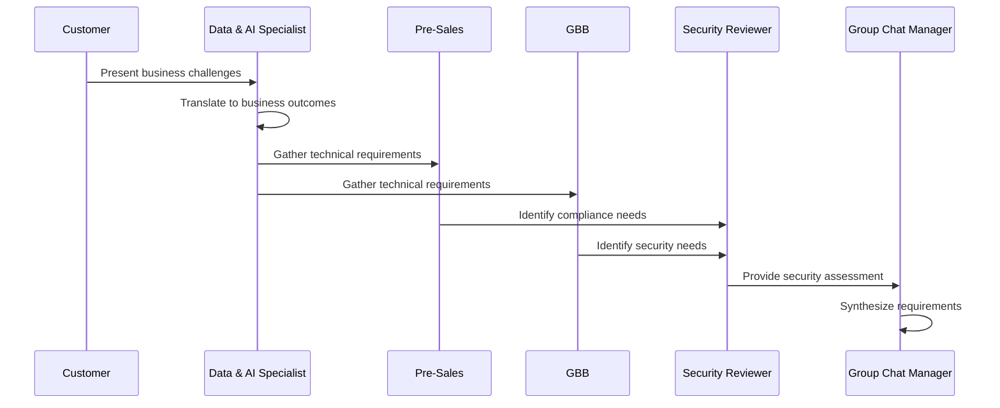
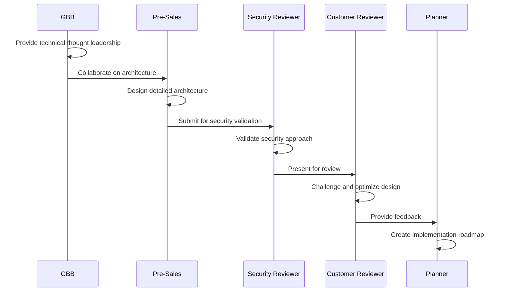
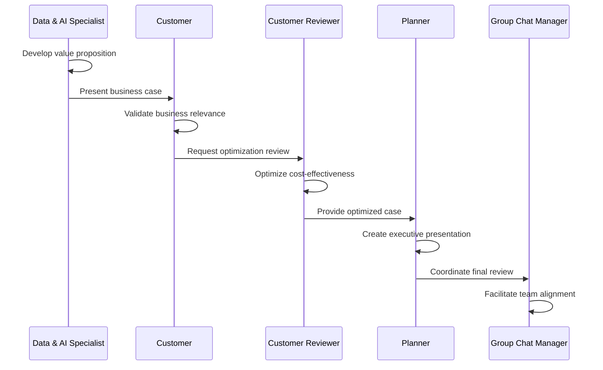

# Microsoft Data & AI Agents - Architecture Diagram

## Overview
This diagram illustrates the comprehensive team architecture with 8 specialized agents organized in three distinct layers, designed for effective customer engagements and solution delivery across Azure Data & AI scenarios.

## Team Architecture Diagram

```mermaid
graph TB
    subgraph "👥 Business & Strategy Layer"
        DAS[💼 Data & AI Specialist<br/>data_ai_specialist<br/>Business Value Translation]
        CUST[🏢 Customer<br/>data_ai_customer<br/>Real-world Business Perspective]
        CR[🔍 Customer Reviewer<br/>data_ai_customer_reviewer<br/>Critical Evaluation & Optimization]
    end
    
    subgraph "⚙️ Technical Implementation Layer"
        PS[🏗️ Pre-Sales<br/>data_ai_presales<br/>Technical Architecture & Design]
        GBB[🌟 GBB (Global Black Belt)<br/>data_ai_gbb<br/>Advanced Technical Expertise]
        SR[🔒 Security Reviewer<br/>data_ai_security_reviewer<br/>Security & Compliance]
    end
    
    subgraph "📋 Coordination & Planning Layer"
        PLAN[📊 Planner<br/>data_ai_planner<br/>Strategic Planning & Orchestration]
        GCM[💬 Group Chat Manager<br/>data_ai_group_chat_manager<br/>Communication & Team Coordination]
    end
    
    %% Workflow connections for Customer Discovery
    CUST --> DAS
    DAS --> PS
    DAS --> GBB
    PS --> SR
    GBB --> SR
    SR --> GCM
    
    %% Planner orchestration
    PLAN --> DAS
    PLAN --> PS
    PLAN --> GBB
    PLAN --> SR
    PLAN --> CR
    
    %% Customer Reviewer interactions
    CR --> DAS
    CR --> PS
    CR --> GBB
    
    %% Group Chat Manager coordination
    GCM --> PLAN
    GCM --> DAS
    GCM --> PS
    GCM --> GBB
    GCM --> SR
    GCM --> CUST
    GCM --> CR
    
    style DAS fill:#4CAF50,stroke:#333,stroke-width:2px,color:#fff
    style CUST fill:#2196F3,stroke:#333,stroke-width:2px,color:#fff
    style PLAN fill:#FF9800,stroke:#333,stroke-width:2px,color:#fff
    style GCM fill:#9C27B0,stroke:#333,stroke-width:2px,color:#fff
    
    classDef business fill:#E8F5E8,stroke:#388E3C,stroke-width:2px
    class DAS,CUST,CR business
    
    classDef technical fill:#E3F2FD,stroke:#1976D2,stroke-width:2px
    class PS,GBB,SR technical
    
    classDef coordination fill:#FFF3E0,stroke:#F57C00,stroke-width:2px
    class PLAN,GCM coordination
```

## Typical Engagement Workflows

### 1. Customer Discovery & Requirements Gathering



### 2. Solution Design & Architecture



### 3. Business Case Development



## Agent Specializations

### Business & Strategy Layer
- **Data & AI Specialist**: Translates technical concepts to business value, creates ROI demonstrations
- **Customer**: Represents authentic business challenges and practical constraints
- **Customer Reviewer**: Provides critical evaluation and cost-effectiveness analysis

### Technical Implementation Layer
- **Pre-Sales**: Designs comprehensive technical architectures and implementation plans
- **GBB**: Delivers advanced technical expertise and global best practices
- **Security Reviewer**: Ensures security compliance and risk management

### Coordination & Planning Layer
- **Planner**: Orchestrates multi-perspective input and creates implementation roadmaps
- **Group Chat Manager**: Facilitates communication and builds team consensus

## Team Composition Guidelines

### Complex Enterprise Deals
**All 8 agents** for comprehensive coverage

### Technical Workshops
**Pre-Sales + GBB + Security Reviewer + Group Chat Manager**

### Business Case Development
**Data & AI Specialist + Customer + Customer Reviewer + Planner**

### Architecture Reviews
**GBB + Pre-Sales + Security Reviewer + Customer Reviewer**

## Success Patterns
- **Start with Customer**: Establish realistic business context
- **Use the Planner**: Orchestrate multiple perspectives for complex scenarios
- **Include Security Early**: Integrate compliance from the beginning
- **Balance Perspectives**: Ensure optimistic and critical voices are heard
- **Leverage Group Chat Manager**: Coordinate complex multi-agent discussions