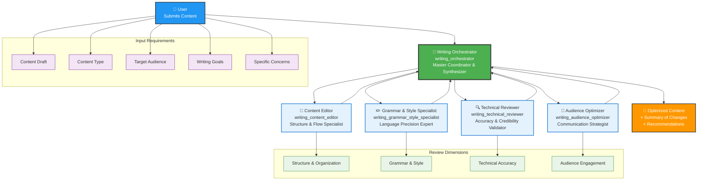

# Writing Assistant Agents - Architecture Diagram

## Overview
This diagram illustrates the coordinated multi-agent architecture where the Writing Orchestrator manages the entire review process and coordinates between specialized agents to deliver optimized content.

## Architecture Diagram

## Workflow Process

### 1. Content Submission
- User submits content draft with context information
- Writing Orchestrator analyzes content and identifies review priorities

### 2. Coordinated Review
- Writing Orchestrator coordinates with specialist agents based on content needs
- Each specialist provides focused feedback in their domain:
  - **Content Editor**: Structure, flow, organization, transitions
  - **Grammar & Style Specialist**: Language precision, consistency, polish
  - **Technical Reviewer**: Fact-checking, accuracy, credibility
  - **Audience Optimizer**: Engagement, accessibility, audience alignment

### 3. Synthesis & Optimization
- Writing Orchestrator synthesizes all feedback into coherent improvements
- Resolves conflicting recommendations between specialists
- Delivers final optimized version with comprehensive change summary

## Agent Interaction Patterns

- **Hub-and-Spoke Model**: Writing Orchestrator serves as central coordination point
- **Parallel Processing**: Specialist agents can work simultaneously on different aspects
- **Feedback Integration**: All specialist input is consolidated by the orchestrator
- **Quality Assurance**: Orchestrator ensures consistency and completeness

## Supported Content Types
- Blog posts and online articles
- Academic papers and research documents  
- Business communications and reports
- Technical documentation
- Marketing and promotional content
- News articles and journalism